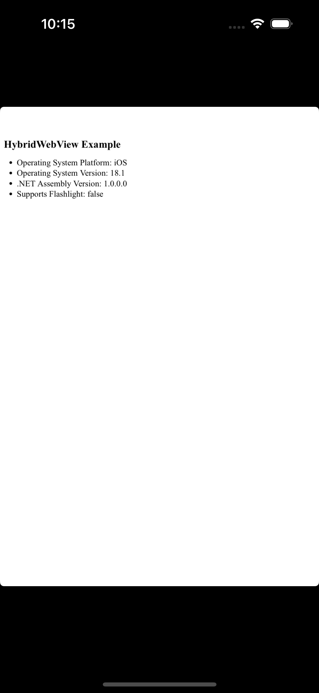

# .NET MAUI HybridWebView DeviceInfo API Example
Example of using .NET 9 MAUI HybridWebView to access MAUI DeviceInfo and other native APIs to JavaScript.

## Kex Aspects
- Expose .NET APIs to the webview, see `MainPage.xaml.cs`
- Access .NET APIs from JavaScript, see `NativeDeviceInfo.js`
- Display data from API in web content (`index.html`), using `HybridWebview` via `MainPage.xaml`

## Screenshot

## Links
- [HybridWebView Documentation](https://learn.microsoft.com/en-us/dotnet/maui/user-interface/controls/hybridwebview?view=net-maui-9.0)